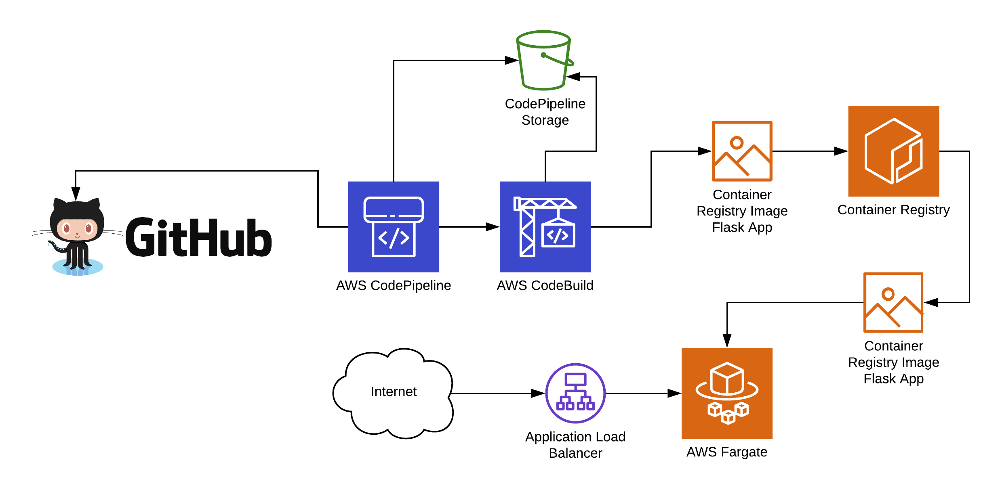
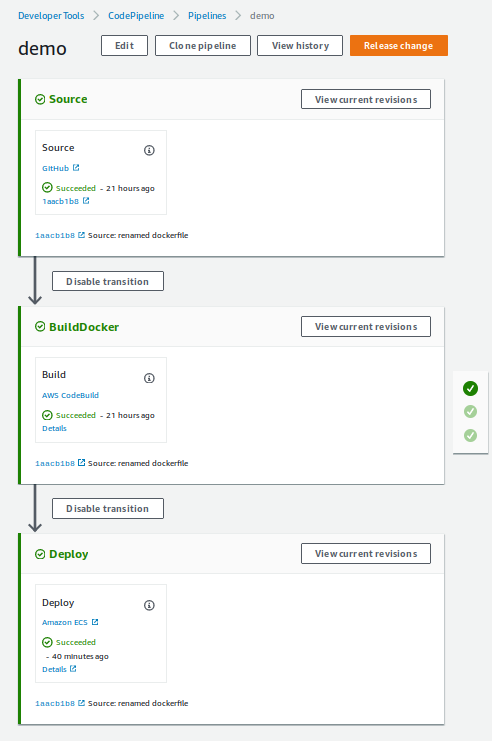

# Introduction

This project creates a Python Flask application, packaged in Docker, that is tested and deployed with AWS CodePipeline to AWS Elastic Container Service Fargate. It is designed to demonstrate application development, Continuous Integration (CI), and Continous Deployment (CD) on Amazon Web Services (AWS). 



The Pipeline performs unit tests on the Flask application, checks the Python code formatting with the `flake8` linter, and the packages the application in a standalone Flask Docker container for deployment.



The following AWS services are used:
* CodePipeline
* CodeBuild
* Elastic Container Service (ECS) - Fargate
* Application Load Balancer (ALB)
* Elastic Container Registry (ECR)
* Virtual Private Cloud (VPC) (subnet, route, security groups, etc)
* Identity and Access Management (IAM)
* Simple Storage Service (S3)

Deployment Software used:
* Terraform (https://terraform.io)
* Docker (https://docker.com)
* GitHub (https://github.com)

# Requirements

Stelligent Mini-Project

This is your chance to WOW us and showcase your experience! Build an application in the
programming language of your choice that exposes a REST endpoint that returns a following
JSON payload with the current timestamp and a static message:

```
{
“message”: “Automation for the People”,
“timestamp”: 1529611161
}
```

Write code in a programming language (or languages, configuration management platforms,
etc.) of your choice that provisions an environment in AWS to run the application you built.
Requirements:

* AWS must be the target infrastructure.
    * Should be able to run in any AWS account.
* Single Command/One-Click launch of environment.
    * Some prerequisites are OK as long as it is properly documented.
* Commit all code to the private repository that is provided for you in Github.
* Include a README.MD containing detailed directions on how to run, what is running, and how to cleanup.
* Include some form of automated tests. Demonstrate a test-first mentality.


# Setup Instructions

First things first, clone this repository!

## GitHub

We need to create a Github token to allow CodePipeline to poll for source code updates on our behalf. Alternative configurations would allow setting up webhooks for source code updates, but due to the project nature settings for webhooks were restricted. In this case, we will have CodePipeline poll GitHub for code changes automatically. To create a token to to the following link:

https://github.com/settings/tokens

Go to GitHub's Token Settings to generate your token and ensure you enable the following scope:

    repo, which is used to read and pull artifacts from public and private repositories into a pipeline

Store the GitHub token in safe place (like a password manager), since we will need it in a few moments when we deploy Terraform configuration.

## Application

Endpoints:

* `GET /` - returns hostname (in this case container id)
* `GET /time` - returns json payload described above with message and timestamp

## AWS

An IAM user is required to run Terraform configuration. The following IAM Permissions are required for deployment (these permissions may be a bit off, since testing has been done with a Administrator user):

* `ecr:*`
* `ecs:*`
* `iam:*`
* `codebuild:*`
* `ec2:*`
* `ecs:*`
* `codepipeline:*`

You must configure your IAM Access Key/Secret Key pair to work with Terraform. Documentation from Terraform is available [here](https://www.terraform.io/docs/providers/aws/index.html) and from AWS [here](https://docs.aws.amazon.com/cli/latest/userguide/cli-configure-files.html). For the purposes of this Demo, using a `~/.aws/credentials` file with the following format will work great:

```
[default]
aws_access_key_id = <redacted>
aws_secret_access_key = <redacted>
```

## Terraform

This demo uses [Terraform](https://www.terraform.io/) for infrastructure-as-code configuration to configure AWS resources for the deployment pipeline.

We can install T erraform from https://www.terraform.io/downloads.html, but for this demo, version `0.12.4` was used. The following links are for Linux and Mac, respectively:
* (MacOS) https://releases.hashicorp.com/terraform/0.12.4/terraform_0.12.4_darwin_amd64.zip
* (Linux) https://releases.hashicorp.com/terraform/0.12.4/terraform_0.12.4_linux_amd64.zip

You can download these files and install Terraform in the proper location with the following commands (from the root of the github repository you previously cloned):
```
# in the root of the github project
# substitute url with above download urls if not using Linux
wget https://releases.hashicorp.com/terraform/0.12.4/terraform_0.12.4_linux_amd64.zip
unzip terraform_0.12.4_linux_amd64.zip 
chmod u+x terraform
```

Now, we need to move to the Terraform configuration and initialize the Terraform modules with these commands:

```
cd terraform-config
../terraform init
```

We need to configure the Terraform variables, so take a look at `terraform.tfvars`. Make sure the repository information is correct, and that you follow the instructions on how to configure your Github token we created previously.

Now for the fun part! One "click" deploy with the following command (usually takes around X minutes):
```
# when prompted, type yes to deploy resources
../terraform apply
```

Terraform will output the Load Balancer URL of the application, which can be visited in a browser. Alternatively you can use `curl` to make requests to the new API:

```
curl <load balancer url>/time
```

Please note that the project uses a nginx server as a placeholder while the first service docker image is built and deployed. You may have to manually trigger the pipeline to deploy the flask application. You can do this by going to the AWS Console (https://console.aws.amazon.com), signing in, and navigating to CodePipeline --> demo --> Click "Release Change" and confirm with "Release". This will "kick" the pipeline off again, resulting in a deployment after tests and packaging stages are completed.

# Teardown

We can destroy all Terraform managed resources with the following command (usually takes around X minutes):

```
cd terraform-config
../terraform destroy
```

Note: There is an issue with Terraform + Fargate where the Service is deleted during the `destroy` operation, but the tasks are not removed: https://github.com/terraform-providers/terraform-provider-aws/issues/3414#issuecomment-475345869. If this happens, you will see log messages during destroy such as: 
```
aws_ecs_service.flask: Still destroying... [id=arn:aws:ecs:us-west-2:<ACCTID>:service/flask, 5m50s elapsed]
```
If this continues for more than an minute (in the above case, almost 6 minutes), go into the AWS console --> ECS --> Cluster --> demo --> Tasks --> delete both tasks.

Alternatively, during the `terraform destroy` operation, you can hit `CTRL+C` to quit (wait for the process to gracefully close), and then restart the `destroy` operation. This also seems to circumvent the bug that is mentioned in that GitHub issue.

We were so close to "one-click" destroys ... :'(

# Future Improvements

- security testing in CodePipeline
- acceptance testing post-deploy
- DNS configuration with a nice domain
- blue/green deployment with codedeploy
- multiple environments (dev,stage,prod)
- separate linting and unit testing into distinct pipeline components
- use setup.py script to separate dev and prod dependencies for Flask app
- Keep flask version between test and run container in sync better
- use branching strategy instead of just deploying off master
- generalize terraform configuration with modules (didnt want to do that for easy following without breaking files up for the time being)
- terratest to test terraform configuration
- alarms based on failures of deploys
- use lambda post deploy [validation test](https://docs.aws.amazon.com/codedeploy/latest/userguide/)reference-appspec-file-structure-hooks.html#appspec-hooks-ecs
- [autoscaling of ECS Task](https://gist.github.com/bradford-hamilton/c0aa213bdc3c83b67c6ffda71814ee18#file-auto_scaling-tf)

# Resources

* https://aws.amazon.com/blogs/devops/use-aws-codedeploy-to-implement-blue-green-deployments-for-aws-fargate-and-amazon-ecs/
* https://medium.com/@vankhoa011/how-to-apply-ci-cd-by-using-github-codebuild-codepipeline-and-ecs-58192b8322a9
* https://www.reddit.com/r/devops/comments/ajkdro/how_to_apply_cicd_by_using_github_codebuild/
* https://github.com/vankhoa011/demo-cicd-codepipeline/blob/master/web/deploy.sh
* https://aws.amazon.com/blogs/compute/continuous-deployment-to-amazon-ecs-using-aws-codepipeline-aws-codebuild-amazon-ecr-and-aws-cloudformation/
* https://github.com/awslabs/ecs-refarch-continuous-deployment/blob/master/templates/deployment-pipeline.yaml
* https://github.com/cloudposse/terraform-aws-cicd
* https://github.com/jasonumiker/clair-ecs-fargate/blob/master/buildspec.yml
* https://docs.aws.amazon.com/AmazonECS/latest/developerguide/ecs-cd-pipeline.html
* https://medium.com/@bradford_hamilton/deploying-containers-on-amazons-ecs-using-fargate-and-terraform-part-2-2e6f6a3a957f
